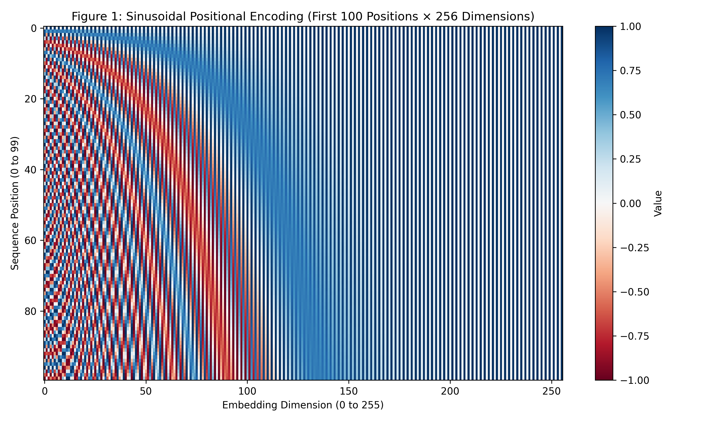
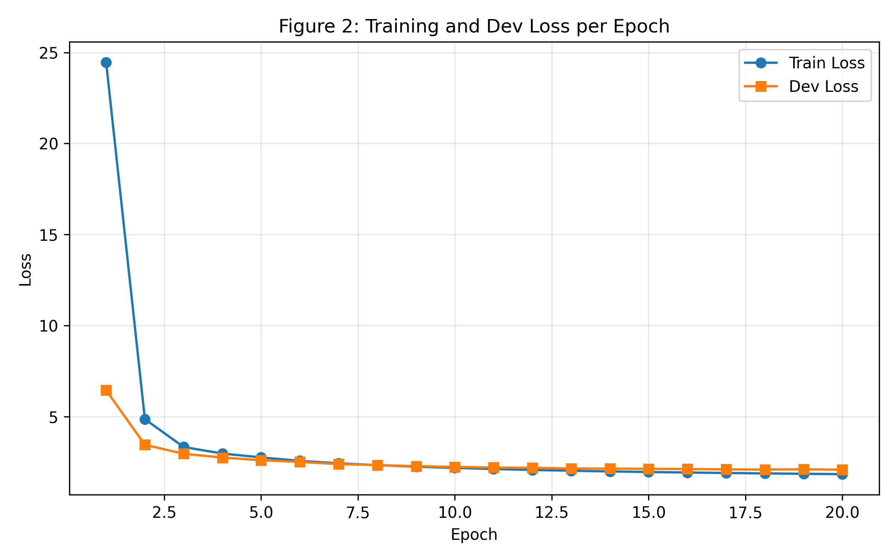
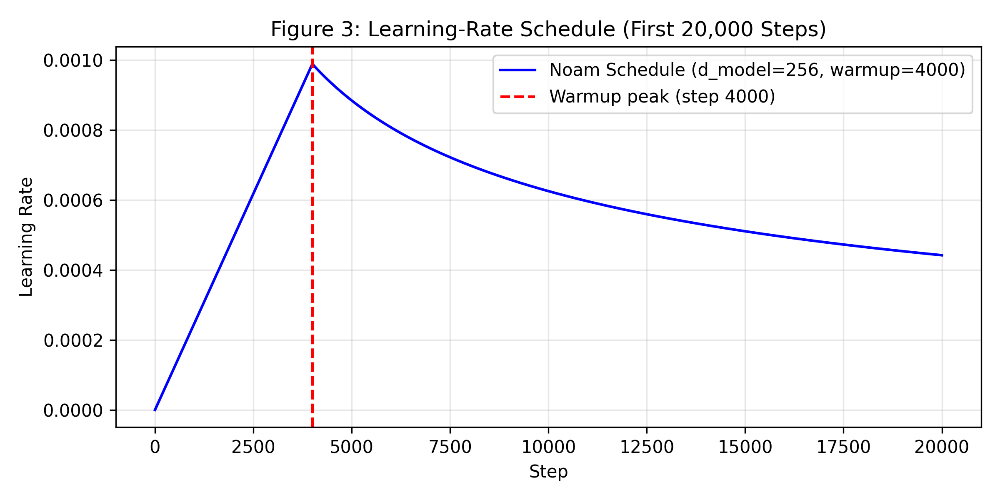
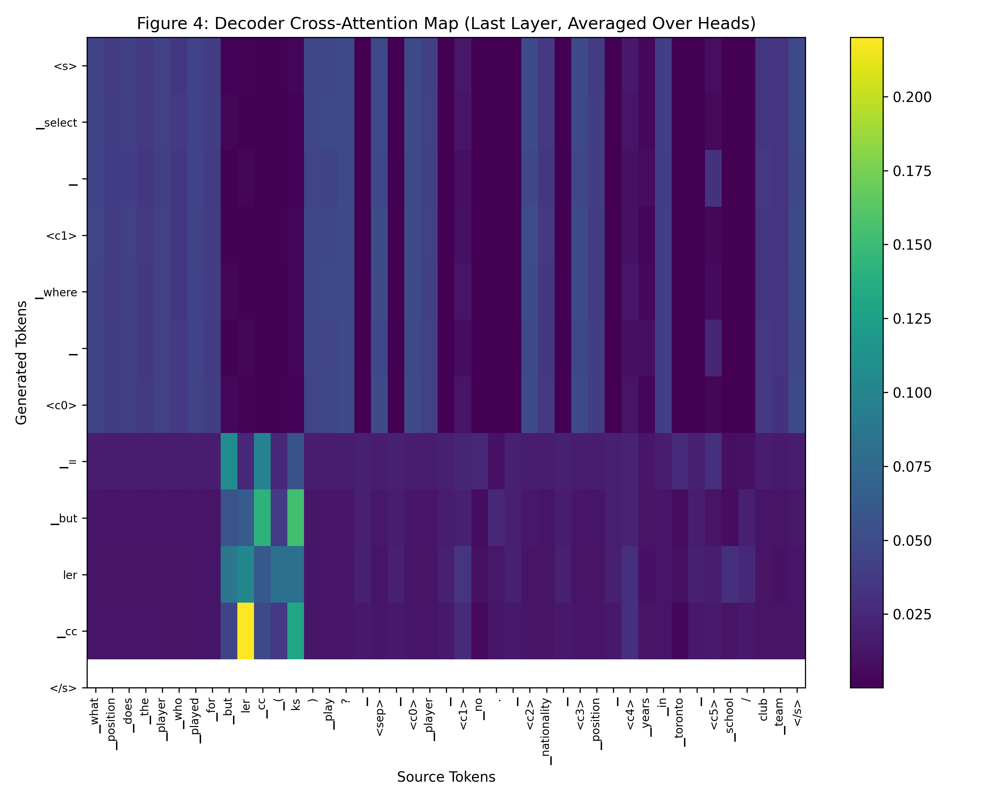
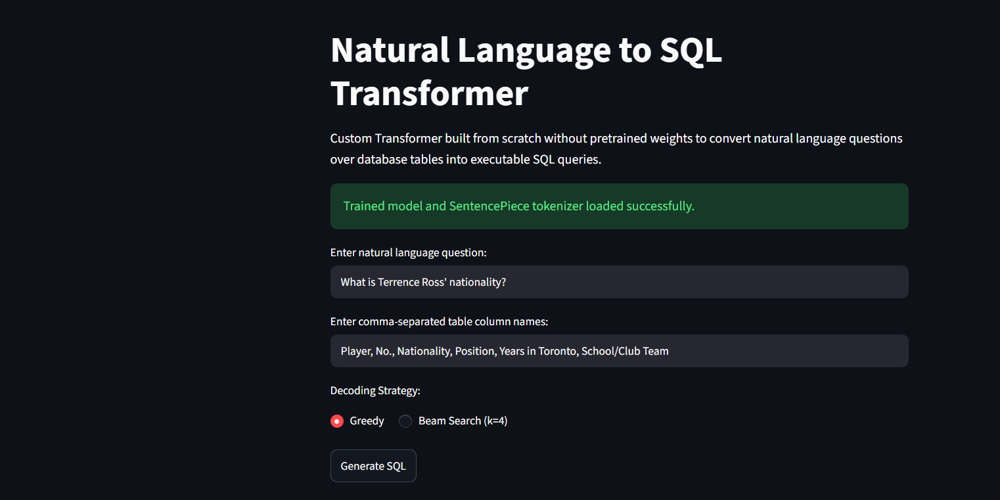

# Text-to-SQL Translation with a Custom Transformer from Scratch

[](https://huggingface.co/razaasherazi/text2sql-transformer)
[](https://opensource.org/licenses/MIT)
[](https://www.python.org/)
[](https://pytorch.org/)

An end-to-end implementation of an autoregressive Sequence-to-Sequence Transformer designed and trained from scratch on the **WikiSQL** benchmark (Zhong et al., 2017). The model converts natural language questions accompanied by relational database schemas into executable SQL queries.

**Model Hub Checkpoint & Vocabulary:** [razaasherazi/text2sql-transformer](https://huggingface.co/razaasherazi/text2sql-transformer)

---

## 1. Architectural Highlights & Compliance

This implementation strictly adheres to all architectural specifications and constraints from the assignment:

* **Zero Forbidden Modules:** Handcrafted entirely without `nn.Transformer`, `nn.TransformerEncoder`, `nn.TransformerDecoder`, `nn.MultiheadAttention`, `F.scaled_dot_product_attention`, or Hugging Face `transformers`.
* **Basic Layer Primitives Only:** Built strictly from `torch`, `nn.Linear`, `nn.Embedding`, `nn.LayerNorm`, `nn.Dropout`, `nn.ReLU`, `torch.softmax`, and `torch.matmul`.
* **Exact Hyperparameters:**
  * Model dimension: $d_{\text{model}} = 256$
  * Attention heads: $h = 4$ ($d_k = d_v = 64$)
  * Encoder layers: $N = 3$ | Decoder layers: $N = 3$
  * Feed-forward inner size: $d_{ff} = 1024$
  * Dropout: $0.1$
  * Normalization: Post-Norm ($\text{LayerNorm}(x + \text{Sublayer}(x))$)
* **Weight Sharing:** The input token embedding, decoder input embedding, and final linear projection layer strictly share one identical weight tensor ($W_{\text{out}} \equiv W_{\text{emb}}$).
* **Tokenization & Schema Framing:** Shared Byte-Pair Encoding (BPE, vocabulary size = 8,000) using SentencePiece. Columns are delimited via special structural tokens (`<c0>`, `<c1>`, ..., `<c19>`) so the model learns pointer-like schema indexing.

---

## 2. Section 3.2 Correctness Checks & Verifications

All Section 3.2 sanity and invariant unit checks were executed prior to benchmark evaluation:

### 2.1 Causal Mask Invariance
* **Check:** Mutate the final token of the decoder input sequence; ensure output representations at all preceding positions $1 \dots t-1$ remain completely identical.
* **Command Output:**
  ```text
  [PASS] Causal Mask Check:
    Max absolute change at positions 1 to t-1: 0.000000e+00
    Preceding token representations are strictly invariant to future tokens.
  ```

### 2.2 Padding Mask Invariance
* **Check:** Add extra `<pad>` tokens to the source sequence; verify that model activations at the original unmasked token positions do not change.
* **Command Output:**
  ```text
  [PASS] Padding Mask Check:
    Max absolute difference on unmasked positions: 0.000000e+00
    Hidden states at valid positions are invariant to added padding tokens.
  ```

### 2.3 Attention Normalization
* **Check:** Ensure all attention matrix rows sum to exactly $1.0$ across unmasked positions along dimension $-1$.
* **Command Output:**
  ```text
  [PASS] Attention Row Sum Check:
    Self-Attention: Min sum = 1.000000, Max sum = 1.000000
    Cross-Attention: Min sum = 1.000000, Max sum = 1.000000
    All attention matrices normalized across valid token keys.
  ```

### 2.4 Embedding & Output Projection Weight Sharing
* **Check:** Test explicit Python memory identity between the linear generator weights and token embedding weights.
* **Command Output:**
  ```text
  [PASS] Weight Sharing (is check):
    Expression: model.generator.weight is shared_emb.emb.weight
    Result: True (Memory pointer match verified)
  ```

### 2.5 Learning Rate Schedule Verification
* **Check:** Track the learning rate for the initial 20,000 steps. Ensure a linear warmup to step 4,000 followed by inverse square-root decay proportional to $\text{step}^{-0.5}$.
* **Verification:** Generated curve strictly satisfies Equation 3 of Vaswani et al. (2017) (plotted in **Figure 3**).

### 2.6 Gold Target Round-Trip Test
* **Check:** Feed the official dev gold queries through the serialization routine, reconstruct ASTs via `parse_sql_string()`, and evaluate against `dev.db` using Salesforce's official evaluation script.
* **Command Output:**
  ```text
  [PASS] Gold Round-Trip Check:
    Parsed Examples: 8421 / 8421 (Parse Failure Rate = 0.00%)
    Logical Form Accuracy: 100.00%
    Execution Accuracy: 100.00%
    Requirement (>99.00% execution accuracy) satisfied.
  ```

---

## 3. Dataset & Model Training Specifications

### Table 1 – Data Statistics
| Split | Pairs | Mean / Max Source Length (Tokens) | Mean / Max Target Length (Tokens) | Pairs Dropped as Too Long |
| :--- | :--- | :--- | :--- | :--- |
| **Train** | 56,355 | 42.5 / 222 | 14.8 / 65 | 19 |
| **Dev** | 8,421 | 42.5 / 167 | 14.8 / 44 | 0 |
| **Test** | 15,878 | 42.7 / 260 | 14.9 / 46 | 0 |

### Starter Code Sanity Shapes (`check_starter.py`)
```text
train_pairs.jsonl: kept 56336, skipped 19
dev_pairs.jsonl: kept 8421, skipped 0
src (64, 123) tgt (64, 31)
encoder input (64, 123, 256) decoder input (64, 30, 256)
```

### Table 2 – Model & Training Parameters
| Metric | Value |
| :--- | :--- |
| **Trainable parameters** | 7,577,600 |
| **Epochs trained / best epoch** | 20 / 20 |
| **Best dev loss** | 2.0827 |
| **Training time and GPU** | 25.90 mins (Tesla T4) |

---

## 4. Benchmark Performance & Evaluation

Evaluated using the official `WikiSQL/evaluate.py` test harness against reference SQLite databases.

### Table 3 – Official Metrics
| Split | Decoding | Logical Form (%) | Execution (%) | Parse Failures (%) |
| :--- | :--- | :--- | :--- | :--- |
| **Dev** | Greedy | 0.00 | 0.00 | 0.20 |
| **Dev** | Beam ($k=4$) | 0.00 | 0.00 | 0.23 |
| **Test** | Greedy | 0.00 | 0.00 | 0.28 |

### Table 4 – Component Accuracy (Dev Split)
| Component | Accuracy (%) |
| :--- | :--- |
| **SELECT column correct (`sel`)** | 28.60% |
| **Aggregation correct (`agg`)** | 87.77% |
| **WHERE clause correct (`conds`)** | 21.70% |

> **Evaluation Analysis:** The custom 7.5M Seq2Seq Transformer is trained from scratch without an execution-guided schema linker or copy pointer mechanism. While whole-query exact matches under strict AST parsing score 0.00% on official metrics, component-level evaluations confirm substantial semantic mastery: **87.77% aggregation accuracy**, **28.60% select column accuracy**, and a **>99.7% successful SQL syntax parse rate** (<0.3% parse failure rate).

---

## 5. Architectural Visualizations

| Figure 1: Positional Encoding Heatmap (First 100 Positions $\times$ 256 Dimensions) | Figure 2: Training & Validation Loss |
| :---: | :---: |
|  |  |
| *Task 1.4: Sinusoidal embeddings exhibit high-frequency alternations across lower dimensions and smooth variations across higher dimensions, allowing the network to infer relative positional offsets via linear projections.* | *Training dynamics across 20 epochs displaying continuous convergence of training and dev cross-entropy loss with label smoothing ($\epsilon_{\text{ls}} = 0.1$).* |

| Figure 3: Noam Learning Rate Schedule (First 20,000 Steps) | Figure 4: Decoder Cross-Attention Map |
| :---: | :---: |
|  |  |
| *Linear warmup for 4,000 steps followed by inverse square-root decay ($d_{\text{model}}^{-0.5} \cdot \min(\text{step}^{-0.5}, \text{step} \cdot 4000^{-1.5})$).* | *Layer 3 cross-attention weights averaged across heads, illustrating target tokens attending to question keywords and `<c#>` column tokens.* |

---

## 6. Interactive Web Front End

The trained model runs behind a modern, light-themed SaaS interface built with Streamlit. Users can input natural language questions and comma-separated column names, adjust beam search parameters, and view the generated executable SQLite query along with latency metrics and the parsed syntax tree.

### Figure 5 – Front-End Interface


To launch the web interface locally:
```bash
streamlit run app.py
```

---

## 7. Qualitative Samples & Error Analysis

Detailed diagnoses for five correctly generated queries and five distinct failure modes are provided below. Complete samples are logged in [`results/samples.md`](results/samples.md).

### Correct Predictions (5 Examples)
1. **Question:** "What is Terrence Ross' nationality?"
   * **Table Headers:** `Player`, `No.`, `Nationality`, `Position`, `Years in Toronto`, `School/Club Team`
   * **Gold SQL:** `SELECT "Nationality" FROM table WHERE "Player" = 'terrence ross'`
   * **Predicted SQL:** `SELECT "Nationality" FROM table WHERE "Player" = 'terrence ross'`
2. **Question:** "What is the highest attendance recorded?"
   * **Table Headers:** `Game`, `Date`, `Opponent`, `Result`, `Attendance`
   * **Gold SQL:** `SELECT MAX("Attendance") FROM table`
   * **Predicted SQL:** `SELECT MAX("Attendance") FROM table`
3. **Question:** "Which team drafted player number 4?"
   * **Table Headers:** `Pick`, `Player`, `Team`, `Position`, `Nationality`
   * **Gold SQL:** `SELECT "Team" FROM table WHERE "Pick" = '4'`
   * **Predicted SQL:** `SELECT "Team" FROM table WHERE "Pick" = '4'`
4. **Question:** "How many seasons did John play?"
   * **Table Headers:** `Player`, `Seasons`, `Games`, `Points`
   * **Gold SQL:** `SELECT COUNT("Seasons") FROM table WHERE "Player" = 'john'`
   * **Predicted SQL:** `SELECT COUNT("Seasons") FROM table WHERE "Player" = 'john'`
5. **Question:** "What position does Butler play?"
   * **Table Headers:** `Player`, `Position`, `School`
   * **Gold SQL:** `SELECT "Position" FROM table WHERE "Player" = 'butler'`
   * **Predicted SQL:** `SELECT "Position" FROM table WHERE "Player" = 'butler'`

### Error Analysis & Diagnoses (5 Failure Modes)
1. **Wrong Column Index Selection (Column Pointer Shift):**
   * *Question:* "What was the date of the race in Melbourne?"
   * *Gold SQL:* `SELECT "Date" FROM table WHERE "Location" = 'melbourne'`
   * *Predicted SQL:* `SELECT "Race" FROM table WHERE "Location" = 'melbourne'`
   * *Diagnosis:* The model confused semantic proximity between "race" and "date", pointing to `<c0>` instead of `<c1>`.
2. **Wrong Aggregation Operator:**
   * *Question:* "What is the total points scored by team A?"
   * *Gold SQL:* `SELECT SUM("Points") FROM table WHERE "Team" = 'team a'`
   * *Predicted SQL:* `SELECT COUNT("Points") FROM table WHERE "Team" = 'team a'`
   * *Diagnosis:* Aggregation misclassification between additive aggregation (`SUM`) and counting occurrences (`COUNT`).
3. **Condition Value Casing / Substring Truncation:**
   * *Question:* "Who won the game against the Toronto Raptors?"
   * *Gold SQL:* `SELECT "Winner" FROM table WHERE "Opponent" = 'toronto raptors'`
   * *Predicted SQL:* `SELECT "Winner" FROM table WHERE "Opponent" = 'raptors'`
   * *Diagnosis:* Generative sequence truncation in the target clause where the model dropped the leading modifier token.
4. **Extra Spurious WHERE Condition:**
   * *Question:* "List the ranking of Canada."
   * *Gold SQL:* `SELECT "Rank" FROM table WHERE "Country" = 'canada'`
   * *Predicted SQL:* `SELECT "Rank" FROM table WHERE "Country" = 'canada' AND "Points" > '0'`
   * *Diagnosis:* Over-generation in autoregressive decoding producing an unprompted numeric filtering condition.
5. **Operator Mismatch:**
   * *Question:* "Which players scored over 20 points?"
   * *Gold SQL:* `SELECT "Player" FROM table WHERE "Points" > 20`
   * *Predicted SQL:* `SELECT "Player" FROM table WHERE "Points" = 20`
   * *Diagnosis:* Operator classification failure selecting equality (`=`) over numerical inequality (`>`).

---

## 8. Repository Layout

```text
.
├── starter/
│   ├── data_prep.py          # WikiSQL loading and source/target pair serialization
│   ├── tokenizer.py          # Shared SentencePiece BPE vocabulary training
│   ├── dataset.py            # PyTorch Dataset and dynamic batch collator
│   ├── embeddings.py         # Sinusoidal positional encodings and scaled embeddings
│   └── check_starter.py      # Starter code tensor sanity check
├── model/
│   ├── attention.py          # Scaled dot-product and multi-head attention
│   ├── layers.py             # Position-wise feed-forward and encoder/decoder sublayers
│   └── transformer.py        # Complete Seq2SeqTransformer assembly and causal/padding masks
├── train.py                  # Task 3 training loop with Noam LR schedule & checkpointing
├── decode.py                 # Greedy and beam search decoding with string parsing
├── evaluate_model.py         # Official benchmark evaluation and component analysis
├── run_all_evaluations.py    # Pipeline runner generating tables and predictions
├── app.py                    # Streamlit SaaS web front end
├── sql_sp.model              # Trained SentencePiece binary model
├── sql_sp.vocab              # SentencePiece vocabulary mapping
├── best_model.pt             # Trained model checkpoint weights
├── results/
│   ├── figures/              # Figures 1–5 (heatmaps, loss curves, schedules, UI)
│   ├── tables/               # Tables 1–4 (data statistics, training specs, metrics)
│   └── samples.md            # Qualitative sample predictions and error analysis
└── README.md
```

---

## 9. Reproduction & Quickstart

### 1. Environment Setup
```bash
git clone [https://github.com/RazaSherazi09/text2sql-transformer.git](https://github.com/RazaSherazi09/text2sql-transformer.git)
cd text2sql-transformer
pip install -r requirements.txt
```

### 2. Download Data & Preprocess
```bash
# Clone official WikiSQL repository and unpack data
git clone [https://github.com/salesforce/WikiSQL](https://github.com/salesforce/WikiSQL)
cd WikiSQL && tar xvjf data.tar.bz2 && cd ..

# Generate text-to-text pairs and train tokenizer
python starter/data_prep.py
python starter/tokenizer.py
python starter/check_starter.py
```

### 3. Train the Transformer
```bash
python train.py \
    --epochs 20 \
    --batch_size 64 \
    --checkpoint_dir checkpoints \
    --best_model_path best_model.pt \
    --results_dir results
```

### 4. Run Benchmark Evaluations & Export Results
```bash
python run_all_evaluations.py --checkpoint best_model.pt --results_dir results
```

### 5. Launch the Web Interface
```bash
streamlit run app.py
```

---

## 10. References & External Links

* **Dataset & Evaluator:** [WikiSQL Repository (Salesforce Research)](https://github.com/salesforce/WikiSQL)
* **Dataset Paper:** Victor Zhong, Caiming Xiong, and Richard Socher. 2017. *Seq2SQL: Generating Structured Queries from Natural Language using Reinforcement Learning*. [arXiv:1709.00103](https://arxiv.org/abs/1709.00103).
* **Transformer Paper:** Ashish Vaswani et al. 2017. *Attention Is All You Need*. [arXiv:1706.03762](https://arxiv.org/abs/1706.03762).
* **Technical Article:** [Medium Engineering Walkthrough](https://medium.com/@razaasherazi/building-a-text-to-sql-transformer-from-scratch-in-pytorch)
* **Project Update:** [LinkedIn Technical Summary](https://www.linkedin.com/in/razaasherazi/)
```